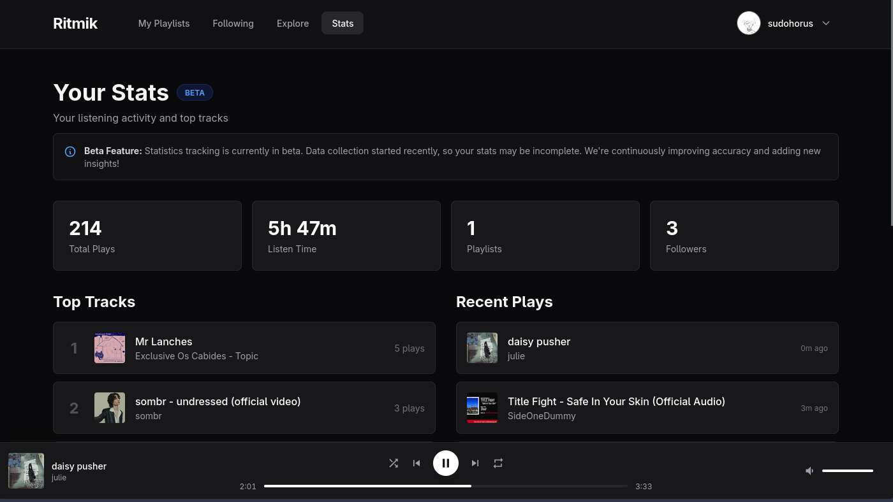

# Ritmik

  

> **Social Music Streaming, Reimagined.**
> Ritmik is a modern music platform designed for shared listening experiences.
> Stream unlimited music, create playlists, and track your stats in real-time.

## 📸 Gallery

|               Profile               |               Stats               |
| :---------------------------------: | :-------------------------------: |
|  |  |

 

## 🗺️ Roadmap

We are constantly evolving. Here is what's coming next:

- 📱 **Mobile App** (React Native)
- 🖥️ **Desktop App** (Electron)
- 🎛️ **Advanced Audio Equalizer**
- 🎨 **Theme Store**

Check out [ROADMAP.md](./ROADMAP.md) for the full list.

 

## 🤝 Contributing

Contributions are welcome and appreciated!  
If you want to help improve **Ritmik**, follow the rules below.

### Contribution Guidelines

- Follow the existing code style and project structure
- Write clear and descriptive commit messages
- Keep pull requests small and focused
- Open an issue before working on large changes or new features

### Bug Reports & Feature Requests

- Use GitHub Issues to report bugs or suggest features
- Include screenshots, logs, and steps to reproduce when possible

## 📄 License

This project is licensed under the MIT License.
